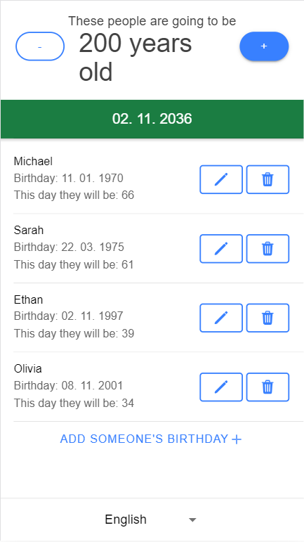

<h1 align="center">Common Age Calculator</h1>

 
   
  <em>Common age calculator calculates a collective birthday by adding up everyone's ages to reach a milestone, 
    like when a group turns a combined age of (2/3/5/10)00 years. It's developed using Angular and Ionic for a seamless experience on both web and mobile.   
   </em>
   

    <a href="https://kacan98.github.io/common-age-calculator" target="_blank"><strong>Try it out here</strong></a>
   

